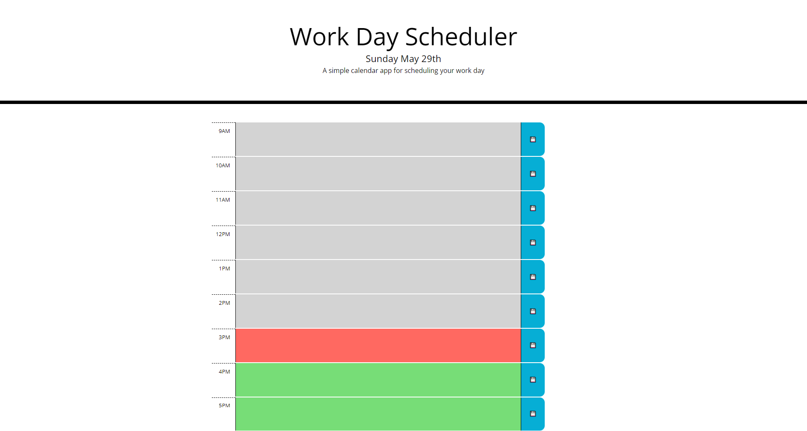

# Title
Workday Scheduler

## Table of Contents
1. [Description](#description)
2. [Visuals](#visuals)
3. [Usage](#usage)
4. [Resources](#resources)

## Description
This is a workday schedule built using JQuery and MomentJS. It displays the current time, and allows you to save events for your workday using local storage.

## Usage
- Click on the colored box corresponding to the time you wish to add information for
- Once you are done editing, click the save button on the right to store your data
- After you save the information, it will persist if you refresh or reopen the page

## Visuals

## Resources
- [Live Site](https://jthefox.github.io/workday-scheduler/)
- [Online Repository](https://github.com/JtheFox/workday-scheduler/)
